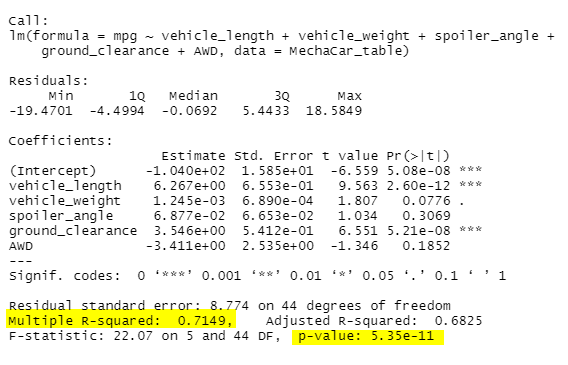
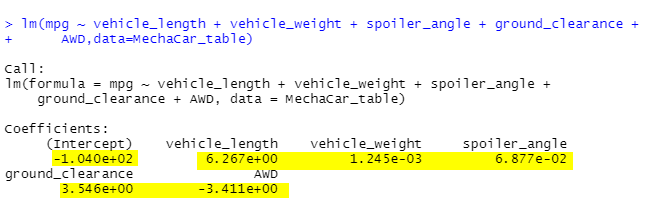
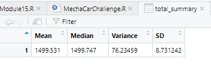
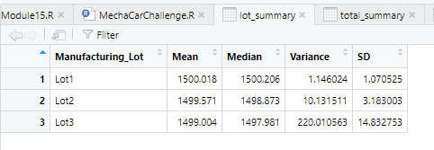
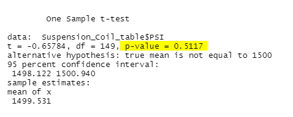
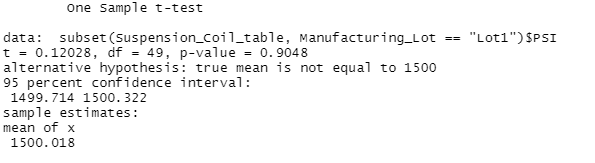
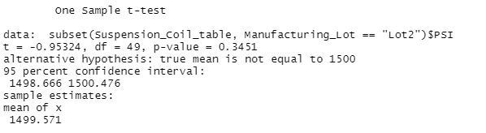
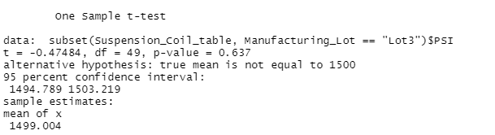

# MechaCar_Statistical_Analysis
In this module, we'll be using R programming language to do statistical analysis and visualizations on a series of datasets from the automotive industry for the AutosRUs company. 

## Linear Regression to Predict MPG
- Which variables/coefficients provided a non-random amount of variance to the mpg values in the dataset?

Vehicle length and ground clearance provided a non-random amount of variance to the mpg values.

- Is the slope of the linear model considered to be zero? Why or why not?
The slope of the linear model is considered to be non-zero. The slope shows a positive correlation between the two categories and mpg.

- Does this linear model predict mpg of MechaCar prototypes effectively? Why or why not?
The Multiple R-squared is 0.7149 and p-value is 5.35e-11 which leads us to reject the null hypothesis. The model is a good linear model predictor for mpg but not perfect. Roughly 72% of the predictions will be correct, which is above average.

## Summary Statistics on Suspension Coils
The design specifications for the MechaCar suspension coils dictate that the variance of the suspension coils must not exceed 100 pounds per square inch. Does the current manufacturing data meet this design specification for all manufacturing lots in total and each lot individually? Why or why not?
The overall summary shows the MechaCar suspension coils meet design specification variance that does not exceed 100 PSI. 

However, once we analyse the lots individually, we see that only lot 1 and 2 lots met the design specification variance that does not exceed 100 PSI.  Lot 3 exceeded the requirement by 120 psi. Hence, the current manufactureing data met hte design specification for all manufacture lots in total but failed to meet the requirement individually.

## T-Tests on Suspension Coils
briefly summarize your interpretation and findings for the t-test results. Include screenshots of the t-test to support your summary. Provide a small writeup of your interpretation and findings for the t-test results.
Our p-value is 0.5117, this is larger than .05. Hence, there is no evidence to reject our null hypothesis. 

## Study Design: MechaCar vs Competition
-What metric or metrics are you going to test?
When buying a car, a lot of consumers will be concerned about the safety features of the car. Hence, one of the metric we can test is to see if our safety features actually reduces accidents on the road compared to other manufaturers. Our hypothesis could the safety features reduces accidents on the road compared with other manufacturers.
-What is the null hypothesis or alternative hypothesis?
Our null hypothesis is our safety features do not reduce accidents compared with other manufacturers.
-What statistical test would you use to test the hypothesis? And why?
Using the t-test to test our hypothesis, because we want to determine whether there is enough statistical evidence in favor of our hypothesis.
-What data is needed to run the statistical test?
We'll need accident data from different manufacturers.